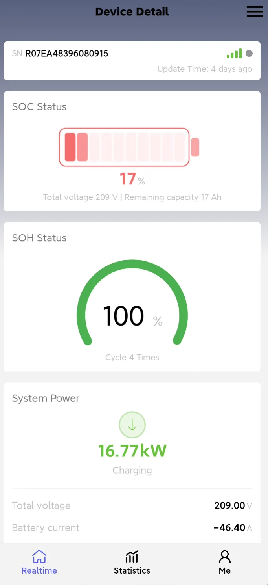
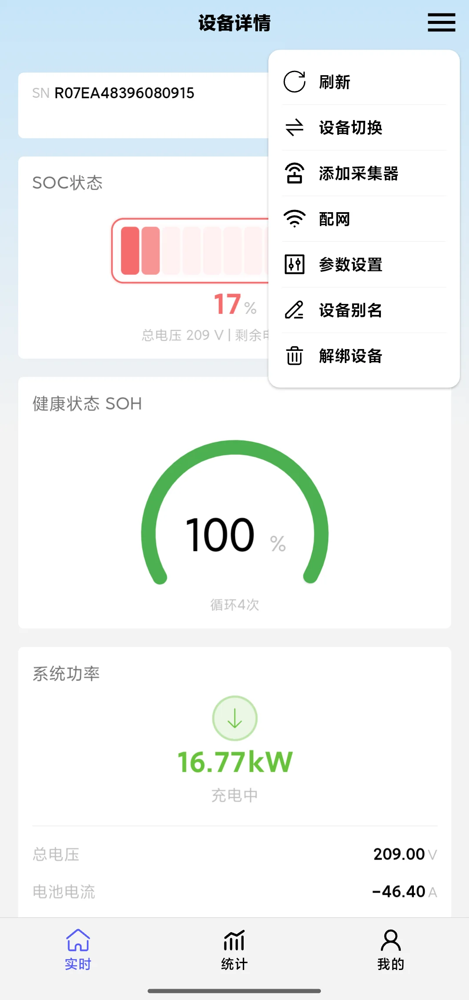

## Perspective Description

The Device User Perspective focuses on a single device: after entering the App you **land directly on the details page of one device**, and the tabs inside the page all revolve around this device. It suits users who only care about the data and debugging of one device (for example, installers responsible for on-site commissioning).

After selecting "Device User" in "My → Switch Perspective", the App enters this perspective.

## Interface After Entering

After entering the Device User Perspective, what you see directly is the **device details** (real-time data cards such as SOC, SOH, system power, current and voltage), with three tabs at the bottom:

| Tab | Content |
|---|---|
| **Real-time** | The real-time data of this device (the parameters shown differ by device type) |
| **Statistics** | The statistics of this device, switchable by time dimension |
| **My** | Account-related functions (content is the same as in other perspectives) |

The menu in the upper right corner of the device details page is the most complete of the three perspectives: **Refresh, Switch Device, Add Logger, Network Configuration, Parameter Settings, Device Alias, Unbind Device**. That is, in this perspective you can directly perform parameter settings, rename, network configuration and unbinding for the device.

## Pages in This Perspective

- [Real-time Data]( "Real-time Data")
- [Device Statistics]( "Device Statistics")
- [Switch Device]( "Switch Device")
- [Network Configuration]( "Network Configuration")
- [Add Logger]( "Add Logger")
- [Parameter Settings]( "Parameter Settings")
- [Device Alias]( "Device Alias")
- [Unbind Device]( "Unbind Device")

## Differences from the Other Two Perspectives

- The Device User Perspective **focuses on one device only**: there is no plant list and no Events tab; to change devices, use "Switch Device" in the device details menu
- The device details menu in this perspective has **Refresh, Switch Device, Add Logger, Network Configuration** more than the [Professional Consultant Perspective]( "Professional Consultant Perspective")
- If you need to view overall data by plant, switch to the [Plant User Perspective]( "Plant User Perspective")
