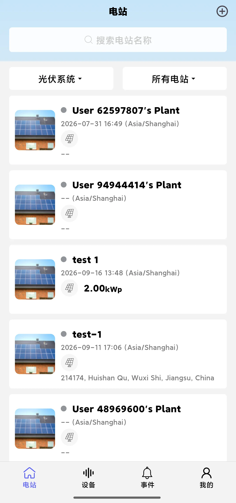
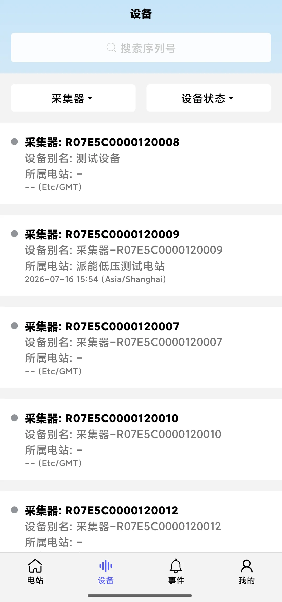
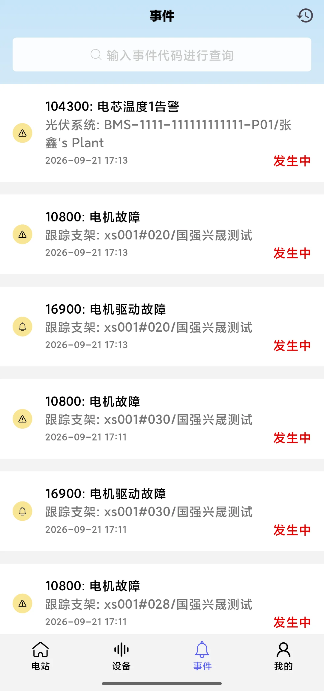

## Perspective Description

The Professional Consultant Perspective is for equipment manufacturers, dealers, installers or professional consultants: these users need to manage **all plants and devices** on the platform and handle the alarm events that occur on the platform.

After selecting "Professional Consultant" in "My → Switch Perspective", the App enters this perspective.

## Interface After Entering

After entering the Professional Consultant Perspective, the first page you see is the **plant list** (all plants within the data permissions of the current account), with four tabs at the bottom:

| Tab | Content |
|---|---|
| **Plant** | List of all plants, supports searching by name and filtering by plant type and online status, and you can enter the plant overview and create a plant |
| **Device** | List of all devices, supports filtering by logger and device status and searching by serial number, and you can enter the device details |
| **Event** | List of events on the platform, supports querying by event code, and you can view the event details |
| **My** | Account related functions (user information, modify password, languages, network configuration, OTA helper, local debug, etc.) |

This is the **only perspective with an "Event" tab** among the three perspectives; the menu in the upper right corner of the plant page provides Create Plant, Switch Plant, Add Logger, Network Configuration and Device List.

## Pages in This Perspective

- Plant
  - [Create Plant]( "Create Plant")
  - [Search Or Filter Plants]( "Search Or Filter Plants")
  - [Switch Plant]( "Switch Plant")
  - [Add Logger]( "Add Logger")
  - [Plant Statistics]( "Plant Statistics")
  - [Plant Layout]( "Plant Layout")
- Device
  - [Device Details]( "Device Details")
  - [Device Statistics]( "Device Statistics")
  - [Search Or Filter Devices]( "Search Or Filter Devices")
  - [Device Event]( "Device Event")
- Event
  - [Search Or Filter Events]( "Search Or Filter Events")
  - [Event Details]( "Event Details")

## Differences from the Other Two Perspectives

- The Professional Consultant Perspective can **view multiple plants side by side**, and can also view all devices and events across plants
- The menu in the upper right corner of device details only contains Parameter Settings, Device Alias and Unbind Device; if you need to **Add Logger, configure the network or Switch Device**, use the [Device User Perspective]( "Device User Perspective")
- If you only need to focus on a single plant or a single device, switch to the [Plant User Perspective]( "Plant User Perspective") or the [Device User Perspective]( "Device User Perspective") for a more focused interface
