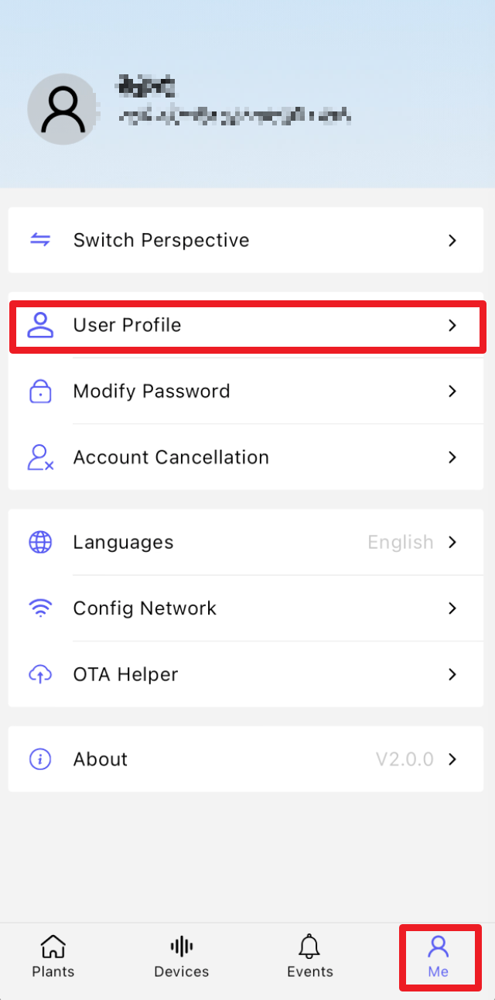

# Function Overview

The "Me" page has the same content in all three perspectives. It contains all account related functions:

- **Switch Perspective**: switch between the Professional Consultant, Plant User and Device User perspectives, see [Switch Perspective]( "Switch Perspective")
- **User Profile**: view the account information
- **Modify Password**: change the login password
- **Account Cancellation**: cancel the current account (cannot be undone)
- **Languages**: switch the interface language of the App
- **Config Network**: configure the network of a logger, see [Network Configuration]( "Network Configuration")
- **OTA Helper**: firmware upgrade (OTA) of devices and loggers
- **Local Debug**: connect to a device over Bluetooth for local debugging, see [Local Debugging]( "Local Debugging")
- **Cache Cleanup**: clear the local cache of the App
- **ORG Toolbox**: organization related toolbox
- **About**: view the App version (e.g. V2.5.2)

> Note: switching the perspective only changes the interface and available functions of the App; it does not affect the data permissions of the account. Which plants, devices and parameters an account can see is decided by the Data Permissions, Role and Measurement Group configured on the Web platform.
