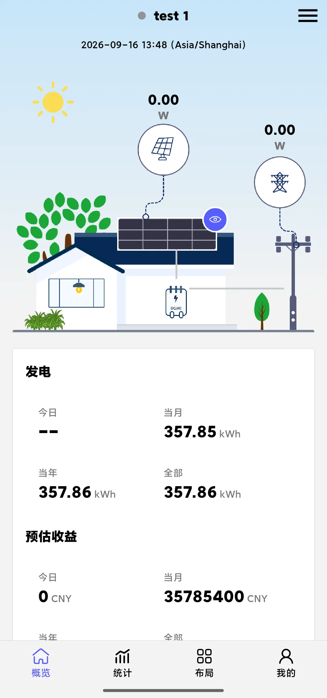
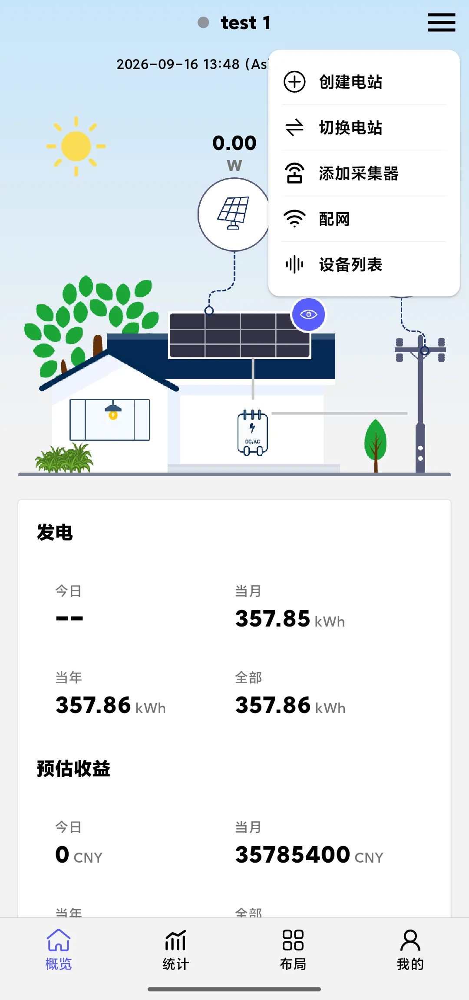

## Perspective Description

The Plant User Perspective focuses on a single plant: after entering the App you **land directly on the overview page of one plant**, and the tabs inside the page all revolve around this plant. It suits users who only care about the generation and revenue data of their own plant (for example, plant owners).

After selecting "Plant User" in "My → Switch Perspective", the App enters this perspective.

## Interface After Entering

After entering the Plant User Perspective, what you see directly is the **overview of one plant** (the overview page shows real-time power, generation, estimated revenue, etc.), with four tabs at the bottom:

| Tab | Content |
|---|---|
| **Overview** | The plant's real-time power, generation (today/this month/this year/all), estimated revenue, and the plant diagram |
| **Statistics** | Historical data statistics of the plant, switchable by day, month, year, or all, with date selection |
| **Layout** | The physical layout of the plant's modules/devices; you can view the layout and curves |
| **My** | Account-related functions (content is the same as in other perspectives) |

The menu in the upper right corner of the overview page provides: Create Plant, Switch Plant, Add Logger, Network Configuration, Device List. Among them, **the Device List only shows the devices under the current plant**.

## Pages in This Perspective

- [Plant Overview]( "Plant Overview")
- [Plant Statistics]( "Plant Statistics")
- [Plant Layout]( "Plant Layout")
- [Switch Plant]( "Switch Plant")
- [Create Plant]( "Create Plant")
- [Add Logger]( "Add Logger")
- [Plant Device List]( "Plant Device List")

## Differences from the Other Two Perspectives

- The Plant User Perspective **focuses on one plant only**: there is no App-level plant list, all-device list, or Events tab; to change plants, use "Switch Plant" in the overview page menu
- If you need to manage devices across plants and view events, switch to the [Professional Consultant Perspective]( "Professional Consultant Perspective")
- If you are concerned with the data and debugging of a single device, switch to the [Device User Perspective]( "Device User Perspective")
