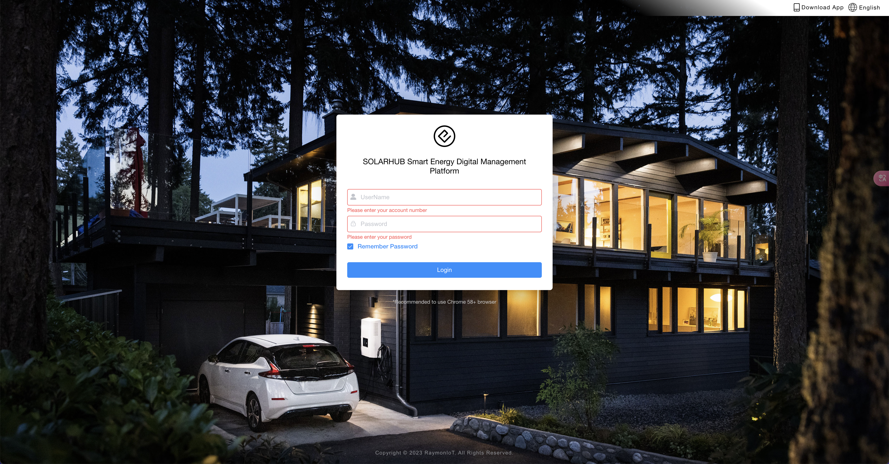

## Solarhub Web overview

Solarhub Web provides comprehensive energy monitoring services for photovoltaic, wind power and energy storage systems, and offers professional and efficient comprehensive energy cloud monitoring platform services for medium and large plants, device manufacturers, O&M providers and residential plant owners.

## Get a Solarhub account

- Trial account: to let you quickly experience the functions of Solarhub, we provide a customer trial account. You can get the trial account and password from your business contact and use them to experience Solarhub. **Mainstream browsers are supported; we recommend Chrome 58, Firefox 49 or IE 9 and above.**

  Steps: visit Solarhub (Web), choose the login method, then enter the trial account and password to log in.

## Introduction to the modules

After logging in, the left menu is divided by module. The most frequently used ones are:

- **Data Dashboard**: an overview of the plant count and the distribution map, see [Data Dashboard]( "Data Dashboard")
- **Plant Center**: manage plants by business type (PV system, Battery system, Residential storage, Commercial plant, etc.), see [Plant Center]( "Plant Center")
- **Device Center**: manage devices by device type (Collector, Inverter, Battery System, Optimizer, Smart Meter, etc.), see [Device Center]( "Device Center")
- **Operation and Maintenance Center**: view device alarm events and handle work orders, see [Operation and Maintenance Center]( "Operation and Maintenance Center")
- **Report Center**: export daily, monthly, annual and total statistics by plant and device, see [Report Center]( "Report Center")
- **Toolbox**: firmware management, batch operation, point query, remote interaction, production test and notice announcement, see [Toolbox]( "Toolbox")
- **Organization management**: organization, member account and measurement group management, see [Organization management]( "Organization management")

The platform also provides modules for administrators, such as internal management and system management, which are generally used by platform O&M staff.

For first-time use, we suggest starting with [Quick Start]( "Quick Start") and going through "collector network configuration → collector import → create plant → add collector → view data".
